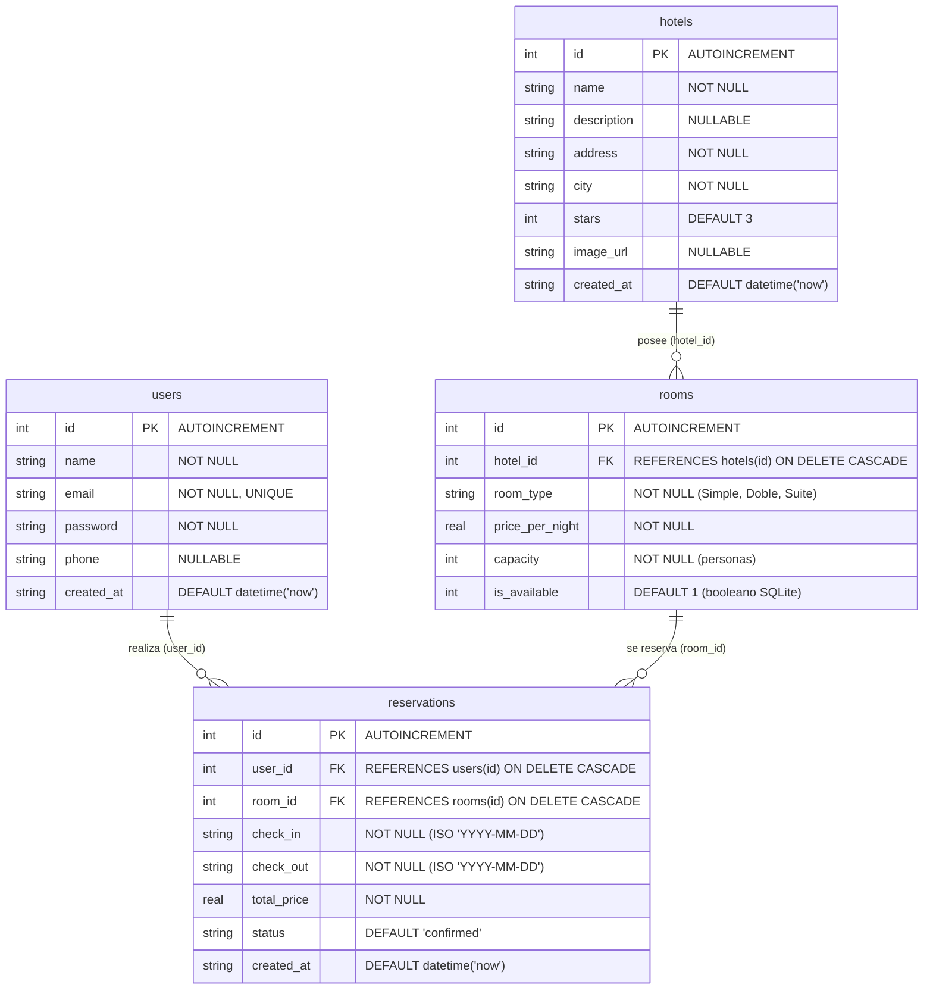

# 📱 Booking App (Estilo Booking.com) - Arquitectura & Guía del Proyecto

Este documento establece el contexto general, la arquitectura de software seleccionada, el diseño y lógica de la base de datos local SQLite, la estructura de carpetas, el sistema de diseño y la hoja de ruta para el desarrollo de la aplicación móvil inspirada en **Booking.com**, desarrollada en **Flutter** para celulares (Android & iOS).

---

## 📌 1. Visión General del Proyecto

- **Objetivo**: Desarrollar una experiencia móvil completa inspirada en Booking.com para búsqueda, exploración, filtrado y reserva de alojamientos (hoteles, apartamentos, resorts).
- **Plataforma objetivo**: Dispositivos móviles (Android / iOS) con soporte responsivo y diseño adaptable.
- **Tecnología**: Flutter (SDK ^3.12.2 / Dart 3.12.2) con Material Design 3.
- **Motor de persistencia local**: SQLite mediante el paquete `sqflite` y `path`.

---

## 🏛️ 2. Arquitectura: Patrón MVC (Model - View - Controller) en Flutter

Para mantener el proyecto modular, escalable y limpio sin sobrecargar la interfaz de usuario con lógica de negocio, se adopta el patrón **MVC adaptado a Flutter**, enriquecido con una capa de servicios y repositorios de datos locales:

```
                  ┌────────────────────────────────────────┐
                  │                 VIEW                   │
                  │  (Screens, Widgets, Formularios)       │
                  └───────────────▲────────┬───────────────┘
                                  │        │
                   Notifica /     │        │ Dispara acciones
                   Escucha estado │        │ del usuario
                                  │        ▼
                  ┌───────────────┴────────────────────────┐
                  │              CONTROLLER                │
                  │ (ChangeNotifier / Lógica de Negocio,   │
                  │  Estados de Carga y Validaciones)      │
                  └───────────────▲────────┬───────────────┘
                                  │        │
                 Retorna entidades│        │ Solicita / Transforma
                                  │        ▼
                  ┌───────────────┴────────────────────────┐
                  │                SERVICES                │
                  │ (AuthService, HotelService,            │
                  │  ReservationService)                   │
                  └───────────────▲────────┬───────────────┘
                                  │        │
                Mapea registros a │        │ Ejecuta operaciones CRUD
                Modelos de Dart   │        │ y sentencias SQL
                                  │        ▼
                  ┌───────────────┴────────────────────────┐
                  │     PERSISTENCE / DATABASE HELPER      │
                  │ (DatabaseHelper Singleton - SQLite DB) │
                  └────────────────────────────────────────┘
```

### Componentes de la Arquitectura:
1. **Models (`lib/models/`)**:
   - Representan las entidades del dominio de negocio.
   - Clases inmutables con constructores nombrados `fromMap` (para deserializar filas de SQLite) y métodos `toMap` (para inserciones/actualizaciones en SQLite), además de `copyWith`.
   - Entidades principales: `UserModel`, `HotelModel`, `RoomModel`, `ReservationModel` (o `BookingModel`).

2. **Views (`lib/views/`)**:
   - Componentes puramente visuales (`StatelessWidget` o `StatefulWidget`).
   - No contienen lógica de negocio ni sentencias SQL directas.
   - Escuchan los cambios emitidos por los controladores mediante `ListenableBuilder` o `AnimatedBuilder` para reconstruir solo la UI necesaria.
   - Organizadas por dominios (`auth`, `home`, `search`, `hotel_detail`, `booking`, `profile`).

3. **Controllers (`lib/controllers/`)**:
   - Clases que extienden `ChangeNotifier` para gestionar el estado y la lógica de interacción.
   - Manejan validaciones de entrada, control de estados reactivos (`isLoading`, `errorMessage`), invocación de servicios y notificación a las vistas vía `notifyListeners()`.
   - Controladores principales: `AuthController`, `HotelController`, `BookingController`.

4. **Services (`lib/services/`)**:
   - Capa de datos encargada de interactuar con la base de datos local SQLite (`DatabaseHelper`) o futuras APIs REST.
   - Abstrae la lógica de consultas SQL (`insert`, `query`, `update`, `delete`), evitando que los controladores conozcan los detalles de la base de datos.
   - Servicios principales: `AuthService`, `HotelService`, `BookingService`.

5. **Persistence (`lib/services/database_helper.dart`)**:
   - Gestor central de conexión SQLite, apertura, migraciones de versión y definición del esquema relacional (tablas, claves primarias y foráneas).

6. **Utils & Theme (`lib/utils/`)**:
   - Constantes de diseño, paleta de colores oficial de Booking.com, estilos tipográficos, rutas de navegación y formateadores (moneda, fechas).

---

## 💾 3. Capa de Persistencia y Base de Datos Local (SQLite / DatabaseHelper)

La persistencia de la aplicación se gestiona de forma nativa mediante SQLite a través del archivo central `lib/services/database_helper.dart`.

### 3.1. Patrón de Diseño y Conexión (`DatabaseHelper`)
- **Patrón Singleton**: Garantiza una única instancia abierta en memoria (`DatabaseHelper.instance`) evitando bloqueos de concurrencia y fugas de memoria.
- **Lazy Initialization**: La base de datos (`booking_app.db`) solo se abre o inicializa cuando un servicio solicita el getter `database`.
- **Ruta Segura**: Se almacena en la ruta de bases de datos del sistema operativo mediante `getDatabasesPath()` y `path.join()`.
- **Versión de Base de Datos**: Versión actual `1` con método `onCreate: _createDB`.

### 3.2. Diagrama Entidad-Relación (ERD)



### 3.3. Especificación Técnica de las Tablas

#### 1. Tabla `users`
- **Propósito**: Almacena las cuentas de usuario para el inicio de sesión y vinculación de reservas.
- **Campos**:
  - `id`: Entero clave primaria autoincremental.
  - `name`: Nombre completo del usuario (`TEXT NOT NULL`).
  - `email`: Correo electrónico único para credenciales (`TEXT NOT NULL UNIQUE`).
  - `password`: Contraseña almacenada (`TEXT NOT NULL`).
  - `phone`: Número de contacto opcional (`TEXT`).
  - `created_at`: Fecha y hora de creación automática (`TEXT DEFAULT (datetime('now'))`).

#### 2. Tabla `hotels`
- **Propósito**: Catálogo de alojamientos disponibles (hoteles, resorts, apartamentos).
- **Campos**:
  - `id`: Clave primaria autoincremental (`INTEGER PRIMARY KEY AUTOINCREMENT`).
  - `name`: Nombre comercial del hotel (`TEXT NOT NULL`).
  - `description`: Resumen de servicios y características (`TEXT`).
  - `address`: Dirección física (`TEXT NOT NULL`).
  - `city`: Ciudad del alojamiento para búsquedas y filtros (`TEXT NOT NULL`).
  - `stars`: Categoría en estrellas (1 a 5, por defecto 3) (`INTEGER DEFAULT 3`).
  - `image_url`: Enlace a fotografía de portada (`TEXT`).
  - `created_at`: Fecha de registro (`TEXT DEFAULT (datetime('now'))`).

#### 3. Tabla `rooms`
- **Propósito**: Tipos de habitaciones pertenecientes a cada hotel.
- **Campos**:
  - `id`: Clave primaria autoincremental (`INTEGER PRIMARY KEY AUTOINCREMENT`).
  - `hotel_id`: Llave foránea hacia `hotels(id)` con `ON DELETE CASCADE`.
  - `room_type`: Denominación (ej. "Habitación Estándar", "Doble Deluxe", "Suite con Vista al Mar").
  - `price_per_night`: Tarifa por noche (`REAL NOT NULL`).
  - `capacity`: Cantidad máxima de huéspedes permitidos (`INTEGER NOT NULL`).
  - `is_available`: Bandera de disponibilidad (1 = activo/disponible, 0 = inactivo) (`INTEGER DEFAULT 1`).

#### 4. Tabla `reservations`
- **Propósito**: Registra las reservas efectuadas por un usuario para una habitación concreta.
- **Campos**:
  - `id`: Clave primaria autoincremental (`INTEGER PRIMARY KEY AUTOINCREMENT`).
  - `user_id`: Llave foránea hacia `users(id)` con `ON DELETE CASCADE`.
  - `room_id`: Llave foránea hacia `rooms(id)` con `ON DELETE CASCADE`.
  - `check_in`: Fecha de entrada en formato ISO `YYYY-MM-DD` (`TEXT NOT NULL`).
  - `check_out`: Fecha de salida en formato ISO `YYYY-MM-DD` (`TEXT NOT NULL`).
  - `total_price`: Importe total liquidado de la estancia (`REAL NOT NULL`).
  - `status`: Estado de la reserva (`'confirmed'`, `'cancelled'`, `'completed'`).
  - `created_at`: Timestamp de creación (`TEXT DEFAULT (datetime('now'))`).

### 3.4. Reglas y Buenas Prácticas de Persistencia en el Proyecto
1. **Activación de Claves Foráneas**: En SQLite las restricciones foráneas vienen desactivadas por defecto. Para asegurar la integridad referencial y las eliminaciones en cascada (`ON DELETE CASCADE`), se debe configurar `onConfigure` en `openDatabase`:
   ```dart
   onConfigure: (db) async {
     await db.execute('PRAGMA foreign_keys = ON');
   }
   ```
2. **Sembrado de Datos Iniciales (Seed Data)**: Para que el catálogo de hoteles y habitaciones no aparezca vacío en la primera ejecución de la aplicación, el `DatabaseHelper` o un servicio de inicialización (`SeedService`) insertará un conjunto de hoteles y habitaciones de muestra en el evento `_createDB`.
3. **Mapeo Tipado**: Toda entidad de la base de datos debe tener su contraparte en `lib/models/` implementando:
   - `toMap()`: Serializa los campos en un `Map<String, dynamic>`.
   - `fromMap(Map<String, dynamic> map)`: Reconstruye la instancia fuertemente tipada.
4. **Fechas Estandarizadas**: Todas las fechas de reserva se manejan en formato ISO-8601 (`YYYY-MM-DD`), facilitando comparaciones cronológicas directas en sentencias SQL (`WHERE check_in <= ? AND check_out >= ?`).

---

## 🎨 4. Identidad Visual y Paleta de Colores (Booking.com Style)

El diseño replica los estándares visuales limpios y reconocibles de Booking.com:

| Nombre | Código Hex | Uso principal |
| :--- | :--- | :--- |
| **Primary Navy Blue** | `#003B95` | AppBar, encabezados, títulos destacados, branding principal |
| **Accent Action Blue** | `#006CE4` | Botones de acción principal (CTA), enlaces, estados activos |
| **Warning / Booking Yellow** | `#FEBB02` | Tarjetas de ofertas, distintivos de descuentos, botones destacados |
| **Rating Green / Badge** | `#008234` | Puntuaciones de reseñas ("Fantástico 9.2", "Muy bien", confirmaciones) |
| **Dark Neutral / Text** | `#1A1A1A` | Tipografía principal, títulos oscuros |
| **Light Neutral / Muted** | `#6B6B6B` | Subtítulos, textos secundarios, iconos inactivos |
| **Background Gray** | `#F5F5F5` | Fondos de pantalla, separadores |
| **Surface White** | `#FFFFFF` | Tarjetas de hoteles, fondos de campos de texto |

---

## 📂 5. Estructura de Directorios (`lib/`)

```
lib/
├── controllers/                  # Controladores (ChangeNotifier - Estado y Lógica)
│   ├── auth_controller.dart      # Login, registro y sesión de usuario (Implementado)
│   ├── hotel_controller.dart     # Búsqueda, filtrado y detalles de hoteles
│   └── booking_controller.dart   # Creación, cálculo y listado de reservas
├── models/                       # Modelos de datos (Mapeo relacional SQLite)
│   ├── user_model.dart           # Entidad User (id, name, email, password) (Implementado)
│   ├── hotel_model.dart          # Entidad Hotel (id, name, city, stars, image_url, etc.)
│   ├── room_model.dart           # Entidad Room (id, hotel_id, room_type, price, capacity)
│   └── reservation_model.dart    # Entidad Reservation (id, user_id, room_id, dates, total)
├── services/                     # Capa de datos y persistencia
│   ├── database_helper.dart      # Singleton SQLite: tablas users, hotels, rooms, reservations (Implementado)
│   ├── auth_service.dart         # Operaciones SQL de usuarios (Implementado)
│   ├── hotel_service.dart        # Consultas SQL de hoteles y habitaciones (con Seed Data)
│   └── booking_service.dart      # Operaciones SQL de reservas e historial
├── utils/                        # Constantes, temas y utilidades
│   ├── app_colors.dart           # Paleta oficial de colores Booking
│   ├── app_routes.dart           # Rutas nombradas de navegación
│   ├── constants.dart            # Constantes globales de configuración
│   └── formatters.dart           # Formato de precios (moneda) y fechas ISO
├── views/                        # Vistas y componentes visuales
│   ├── auth/                     # Módulo de Autenticación
│   │   ├── login_screen.dart     # Pantalla de Login reactiva (Implementada)
│   │   └── register_screen.dart  # Pantalla de Registro reactiva (Implementada)
│   ├── home/                     # Módulo Principal
│   │   ├── home_screen.dart      # Pantalla de bienvenida / Dashboard temporal (Implementada)
│   │   └── main_navigation_screen.dart # BottomNavigationBar (Buscar, Guardados, Reservas, Perfil)
│   ├── search/                   # Módulo de Búsqueda
│   │   ├── search_results_screen.dart  # Listado de hoteles con filtros
│   │   └── filter_modal.dart           # Modal de rango de precio y estrellas
│   ├── hotel_detail/             # Módulo de Detalle
│   │   ├── hotel_detail_screen.dart    # Ficha del hotel, amenidades y fotos
│   │   └── select_room_screen.dart     # Selección de habitación disponible
│   ├── booking/                  # Módulo de Reserva
│   │   ├── checkout_screen.dart        # Confirmación de fechas, huésped y desglose
│   │   └── booking_confirmation_screen.dart # Comprobante de reserva exitosa
│   ├── profile/                  # Módulo de Perfil
│   │   └── profile_screen.dart         # Información de cuenta y cierre de sesión
│   └── widgets/                  # Widgets reutilizables comunes
│       ├── custom_button.dart
│       ├── custom_text_field.dart
│       ├── hotel_card.dart
│       └── rating_badge.dart
└── main.dart                     # Punto de entrada de la aplicación
```

---

## 🔍 6. Diagnóstico y Estado Actual del Repositorio

1. **Persistencia SQLite Implementada (`lib/services/database_helper.dart`)**:
   - Conexión Singleton operativa con `sqflite` y `path`.
   - 4 tablas creadas: `users`, `hotels`, `rooms` y `reservations`, con claves foráneas e integridad referencial en cascada.
2. **Módulo de Autenticación Completado (MVC Completo)**:
   - `UserModel` (`lib/models/user_model.dart`): Mapeo completo `toMap()`, `fromMap()` y `copyWith()`.
   - `AuthService` (`lib/services/auth_service.dart`): Consultas SQL para registro, login con validación de credenciales, y comprobación de correos duplicados.
   - `AuthController` (`lib/controllers/auth_controller.dart`): Gestión de estados reactivos (`isLoading`, `errorMessage`, `currentUser`), validación de entradas y notificación a vistas.
   - `LoginScreen` y `RegisterScreen`: Interfaces de usuario funcionales, conectadas a `AuthController` mediante `ListenableBuilder` y validadas sin errores ni advertencias de linter.
3. **Módulo Inicial de Bienvenida (`lib/views/home/home_screen.dart`)**:
   - Pantalla de bienvenida con confirmación visual del usuario logueado y botón para cerrar sesión.
4. **Próximos Componentes a Desarrollar**:
   - Modelos de `HotelModel`, `RoomModel` y `ReservationModel`.
   - `HotelService` con mecanismo de **Seeding** para precargar hoteles y habitaciones en SQLite en la primera instalación.
   - Navegación principal mediante `MainNavigationScreen` con `BottomNavigationBar` de 4 secciones.

---

## 🚀 7. Hoja de Ruta Actualizada (Roadmap)

- [x] **Fase 1: Configuración Base y Base de Datos SQLite**
  - Implementar `DatabaseHelper` con las tablas `users`, `hotels`, `rooms` y `reservations`.
  - Configurar dependencias (`sqflite`, `path`) y asegurar integridad con claves foráneas.
- [x] **Fase 2: Arquitectura MVC de Autenticación**
  - Desarrollar `UserModel` con métodos de serialización SQLite.
  - Desarrollar `AuthService` con consultas SQL de inserción y autenticación.
  - Desarrollar `AuthController` con control de estados y notificaciones reactivas.
  - Conectar `LoginScreen` y `RegisterScreen` de forma reactiva con feedback visual.
- [ ] **Fase 3: Sembrado de Datos (Seed Data) y Servicios de Alojamiento**
  - Implementar `HotelModel` y `RoomModel` con serialización `fromMap`/`toMap`.
  - Crear datos semilla iniciales de hoteles y habitaciones en `database_helper.dart` o `hotel_service.dart`.
  - Implementar métodos de consulta en `HotelService`: listar todos los hoteles, filtrar por ciudad, y consultar habitaciones por `hotel_id`.
- [ ] **Fase 4: Navegación Principal Móvil (`MainNavigationScreen`)**
  - Barra de navegación inferior (BottomNavigationBar) con 4 pestañas:
    1. 🔍 **Buscar** (Home con buscador interactivo)
    2. 💙 **Guardados** (Favoritos locales)
    3. 🧳 **Reservas** (Reservas activas y pasadas del usuario actual en SQLite)
    4. 👤 **Perfil** (Datos de cuenta y opción de cerrar sesión)
- [ ] **Fase 5: Pantalla de Inicio y Buscador de Hoteles (Home)**
  - Banner de destino ("¿A dónde vas?"), selector de fechas de estancia y número de huéspedes.
  - Sección de promociones y carrusel de alojamientos recomendados cargados desde SQLite.
- [ ] **Fase 6: Resultados de Búsqueda y Filtros**
  - Pantalla con tarjetas de hoteles obtenidas de SQLite con filtros dinámicos (estrellas, ciudad, rango de precios).
  - Componente de badge de calificación ("Fantástico 9.2").
- [ ] **Fase 7: Ficha Detallada del Hotel y Selección de Habitación**
  - Galería visual, ubicación, amenidades y consulta de habitaciones asociadas (`rooms` filtradas por `hotel_id`).
  - Tarjetas de habitación con capacidad, precio por noche y botón "Reservar".
- [ ] **Fase 8: Flujo de Reserva y Persistencia de Transacciones**
  - Implementar `ReservationModel` y `BookingService`.
  - Inserción en la tabla `reservations` asociando `user_id`, `room_id`, fechas de entrada/salida y precio total calculado.
  - Pantalla de confirmación con código de reserva.
- [ ] **Fase 9: Gestión de Reservas y Perfil de Usuario**
  - Pantalla de mis reservas con consulta `INNER JOIN` entre `reservations`, `rooms` y `hotels` para el usuario en sesión.
  - Funcionalidad para cancelar reservas activas (`status = 'cancelled'`).
